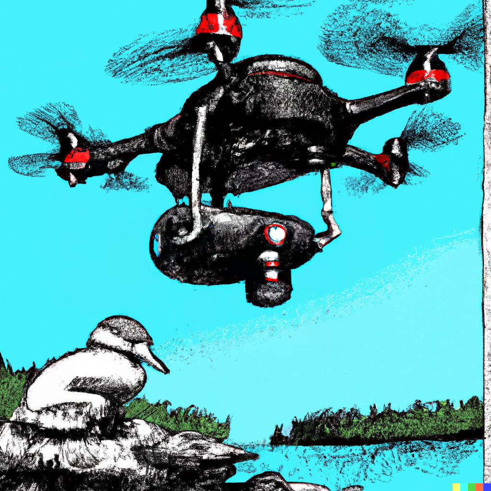

# birdnest report

## A web application for monitoring recent violators of the Monadikuikka NDZ -- [PROJECT BIRDNEST](https://assignments.reaktor.com/birdnest/)

> A rare and endangered Monadikuikka has been spotted nesting at a local lake.

> Unfortunately some enthusiasts have been a little too curious about this elusive bird species, flying their drones very close to the nest for rare photos and bothering the birds in the process.

    
     Image generated by <a href="https://openai.com/dall-e-2/" target="_blank">OpenAI DALL-E 2</a> 

birdnest report includes a Flask server which queries the monitoring equipment of the Monadikuikka nest and the national drone registry and serves an endpoint `/report`, and a React app which displays the information on pilots who have recently violated the NDZ perimeter, including their contact information and closest approach.

#### You can test birdnest report out for yourself!

###### Installation:

It is a good idea to run birdnest in a virtual environment. Set this up with the required dependencies with the following commands.

`python3 -m venv venv` 
`. venv/bin/activate` 
`pip install -r requirements.txt` 
`npm install` in react-app directory

###### Running:

`python3 init_db.py` to create the SQLite database and table 
`python3 updater.py &` to launch updater in the background 
`flask run` to launch Flask server 
`npm start` in react-app directory to launch web app

The React app will run on http://localhost:3000/.
You may also freely use the web browser or otherwise to make HTTP requests to report,
http://127.0.0.1:5000/report.

To access database, run:
`sqlite3 database.db` and, e.g. `SELECT * FROM drone;`
